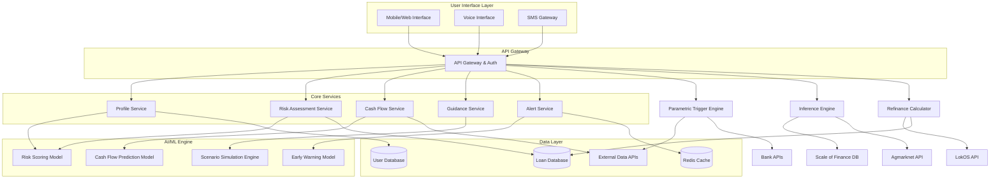

# Design Document: AI-Powered Rural Credit Decision Support System

## Overview

The AI-powered rural credit decision support system is designed to address critical credit capability gaps in rural India by providing personalized, data-driven guidance for borrowing decisions. The system combines machine learning models with domain expertise to align credit access with volatile livelihood cash-flow cycles, reduce loan stress pathways, and improve financial outcomes for underserved rural populations.

The system serves as an intelligent intermediary between borrowers and credit providers, offering risk assessment, early warning capabilities, and scenario-based planning tools. By leveraging AI to understand complex rural financial patterns, the system enables more informed credit decisions while reducing default risks.

## Architecture

The system follows a microservices architecture with AI/ML components integrated throughout the data pipeline:



## Components and Interfaces

### 1. Profile Service
**Purpose**: Manages comprehensive borrower profiles including financial history, livelihood patterns, and demographic information.

**Key Interfaces**:
- `createProfile(borrowerData: BorrowerInput): ProfileId`
- `updateProfile(profileId: ProfileId, updates: ProfileUpdate): Profile`
- `getProfile(profileId: ProfileId): Profile`
- `calculateIncomeVolatility(profileId: ProfileId): VolatilityMetrics`

**Integration Points**:
- Connects to User Database for persistent storage
- Feeds data to Risk Scoring Model for assessment
- Provides historical patterns to Cash Flow Prediction Model

### 2. Risk Assessment Service
**Purpose**: Generates comprehensive risk scores considering rural-specific factors, income volatility, and multi-loan exposure.

**Key Interfaces**:
- `assessRisk(profileId: ProfileId): RiskAssessment`
- `updateRiskScore(profileId: ProfileId, newData: RiskFactors): RiskScore`
- `explainRiskScore(riskScore: RiskScore): RiskExplanation`
- `compareRiskProfiles(profileIds: ProfileId[]): RiskComparison`

**Integration Points**:
- Consumes data from Profile Service and Multi-Loan Tracker
- Utilizes Risk Scoring ML Model for predictions
- Provides input to Early Warning System

### 3. Cash Flow Service
**Purpose**: Predicts future cash flows based on seasonal patterns, market conditions, and livelihood cycles.

**Key Interfaces**:
- `predictCashFlow(profileId: ProfileId, timeHorizon: Duration): CashFlowForecast`
- `alignCreditTiming(cashFlow: CashFlowForecast, loanAmount: Amount): TimingRecommendation`
- `calculateRepaymentCapacity(profileId: ProfileId): RepaymentCapacity`
- `updateSeasonalPatterns(profileId: ProfileId, actualData: CashFlowData): void`

**Integration Points**:
- Uses Cash Flow Prediction ML Model for forecasting
- Integrates with External Data APIs for market and weather data
- Provides input to Guidance Service for recommendations

### 4. Multi-Loan Tracker
**Purpose**: Monitors and aggregates borrower's total debt exposure across all credit sources.

**Key Interfaces**:
- `trackLoan(profileId: ProfileId, loanDetails: LoanInfo): TrackingId`
- `updateLoanStatus(trackingId: TrackingId, status: LoanStatus): void`
- `getTotalExposure(profileId: ProfileId): DebtExposure`
- `calculateDebtToIncomeRatio(profileId: ProfileId): Ratio`

**Integration Points**:
- Stores loan data in Loan Database
- Provides exposure data to Risk Assessment Service
- Feeds into Early Warning System calculations

### 5. Early Warning System
**Purpose**: Proactively identifies potential repayment difficulties and generates actionable alerts.

**Key Interfaces**:
- `monitorRepaymentRisk(profileId: ProfileId): AlertStatus`
- `generateAlert(profileId: ProfileId, riskFactors: RiskFactors): Alert`
- `escalateAlert(alertId: AlertId, severity: AlertSeverity): void`
- `getActionableRecommendations(alertId: AlertId): Recommendations`

**Integration Points**:
- Uses Early Warning ML Model for risk detection
- Consumes data from Risk Assessment and Cash Flow Services
- Triggers notifications through Alert Service

### 6. Scenario Simulation Engine
**Purpose**: Models various income shock scenarios and their impact on repayment capacity.

**Key Interfaces**:
- `simulateIncomeShock(profileId: ProfileId, shockScenario: Scenario): SimulationResult`
- `runWeatherImpactAnalysis(profileId: ProfileId, weatherData: WeatherScenario): ImpactAssessment`
- `modelMarketVolatility(profileId: ProfileId, marketScenario: MarketConditions): VolatilityImpact`
- `generateRiskAdjustedRecommendations(simulations: SimulationResult[]): Recommendations`

**Integration Points**:
- Utilizes Scenario Simulation ML Engine
- Integrates with External Data APIs for scenario parameters
- Provides input to Guidance Service

### 7. Guidance Service
**Purpose**: Generates personalized credit recommendations based on AI analysis and risk assessment.

**Key Interfaces**:
- `generateCreditGuidance(profileId: ProfileId, creditRequest: CreditRequest): CreditGuidance`
- `optimizeLoanTiming(profileId: ProfileId, loanAmount: Amount): TimingGuidance`
- `recommendLoanAmount(profileId: ProfileId, purpose: LoanPurpose): AmountGuidance`
- `explainRecommendation(guidanceId: GuidanceId): GuidanceExplanation`

**Integration Points**:
- Aggregates data from all core services
- Uses multiple ML models for comprehensive analysis
- Formats output for user interface presentation

### 8. Parametric Trigger Engine (Bank Disconnect Bridge)
**Purpose**: Automatically restructures loans via bank APIs when parametric trigger conditions (weather events, market price drops) are met, eliminating manual intervention delays.

**Key Interfaces**:
- `registerTrigger(profileId: ProfileId, loanId: LoanId, triggerConditions: TriggerConditions): TriggerId`
- `evaluateTriggers(externalData: ExternalDataUpdate): TriggerEvaluation[]`
- `executeLoanRestructuring(triggerId: TriggerId, bankApi: BankAPI): RestructuringResult`
- `notifyRestructuring(profileId: ProfileId, restructuringDetails: RestructuringDetails): NotificationStatus`

**Integration Points**:
- Consumes weather data from External Data APIs
- Integrates with Agmarknet for market price monitoring
- Connects to bank APIs for automatic loan modification
- Triggers notifications through Alert Service
- Updates loan status in Multi-Loan Tracker

### 9. Inference Engine (Data Friction Bridge)
**Purpose**: Automatically calculates borrower cash flow using District Scale of Finance norms and Agmarknet market data, reducing manual data entry burden.

**Key Interfaces**:
- `inferCashFlow(profileId: ProfileId, cropInfo: CropInfo, location: Location): InferredCashFlow`
- `fetchScaleOfFinance(district: District, crop: Crop, season: Season): FinanceScale`
- `fetchMarketPrices(commodity: Commodity, market: Market, dateRange: DateRange): PriceData[]`
- `allowOverride(profileId: ProfileId, inferredData: InferredCashFlow, actualData: ActualCashFlow): CashFlowData`

**Integration Points**:
- Integrates with District Scale of Finance databases
- Connects to Agmarknet API for real-time price data
- Feeds calculated cash flow to Cash Flow Service
- Provides data confidence indicators to Profile Service
- Supports manual override through user interface

### 10. Refinance Calculator and LokOS Integration (Hidden Debt Bridge)
**Purpose**: Incentivizes debt disclosure by showing refinancing benefits and automatically fetches SHG loan data from LokOS to reduce hidden debt.

**Key Interfaces**:
- `calculateRefinanceBenefits(profileId: ProfileId, disclosedLoans: LoanInfo[]): RefinancingAnalysis`
- `fetchSHGLoans(profileId: ProfileId, lokosApi: LokOSAPI): SHGLoanData[]`
- `compareDebtScenarios(currentDebt: DebtExposure, consolidatedDebt: ConsolidatedDebt): ComparisonResult`
- `generateRefinancingPlan(profileId: ProfileId, totalExposure: DebtExposure): RefinancingPlan`

**Integration Points**:
- Integrates with LokOS API for SHG loan data
- Consumes debt data from Multi-Loan Tracker
- Provides refinancing analysis to Guidance Service
- Updates total exposure calculations automatically
- Presents incentive-based recommendations through UI

## Data Models

### Core Data Structures

```typescript
interface BorrowerProfile {
  profileId: ProfileId;
  personalInfo: PersonalInfo;
  livelihoodInfo: LivelihoodInfo;
  financialHistory: FinancialHistory;
  incomePatterns: IncomePattern[];
  expensePatterns: ExpensePattern[];
  seasonalFactors: SeasonalFactor[];
  volatilityMetrics: VolatilityMetrics;
  createdAt: Timestamp;
  updatedAt: Timestamp;
}

interface LivelihoodInfo {
  primaryOccupation: OccupationType;
  secondaryOccupations: OccupationType[];
  landHolding: LandDetails;
  cropPatterns: CropInfo[];
  livestockInfo: LivestockInfo;
  migrationPatterns: MigrationInfo[];
}

interface RiskAssessment {
  riskScore: number; // 0-1000 scale
  riskCategory: 'LOW' | 'MEDIUM' | 'HIGH' | 'VERY_HIGH';
  riskFactors: RiskFactor[];
  confidenceLevel: number;
  explanation: RiskExplanation;
  validUntil: Timestamp;
}

interface CashFlowForecast {
  profileId: ProfileId;
  forecastPeriod: DateRange;
  monthlyProjections: MonthlyProjection[];
  seasonalAdjustments: SeasonalAdjustment[];
  uncertaintyBands: UncertaintyBand[];
  assumptions: ForecastAssumption[];
}

interface DebtExposure {
  totalOutstanding: Amount;
  loansBySource: LoanSource[];
  monthlyObligations: Amount;
  debtToIncomeRatio: number;
  creditUtilization: number;
  repaymentSchedule: RepaymentSchedule[];
}

interface Alert {
  alertId: AlertId;
  profileId: ProfileId;
  alertType: AlertType;
  severity: AlertSeverity;
  riskFactors: RiskFactor[];
  recommendations: ActionableRecommendation[];
  createdAt: Timestamp;
  acknowledgedAt?: Timestamp;
}

interface CreditGuidance {
  guidanceId: GuidanceId;
  profileId: ProfileId;
  recommendedAmount: AmountRange;
  optimalTiming: TimingWindow;
  suggestedTerms: LoanTerms;
  riskAssessment: RiskSummary;
  alternativeOptions: AlternativeOption[];
  reasoning: GuidanceReasoning;
}

interface ParametricTrigger {
  triggerId: TriggerId;
  profileId: ProfileId;
  loanId: LoanId;
  triggerType: 'WEATHER' | 'MARKET_PRICE' | 'COMPOSITE';
  conditions: TriggerCondition[];
  restructuringAction: RestructuringAction;
  status: 'ACTIVE' | 'TRIGGERED' | 'EXECUTED' | 'EXPIRED';
  createdAt: Timestamp;
  triggeredAt?: Timestamp;
}

interface TriggerCondition {
  dataSource: 'WEATHER_API' | 'AGMARKNET' | 'IMD';
  parameter: string; // e.g., 'rainfall', 'temperature', 'price'
  threshold: number;
  operator: 'LESS_THAN' | 'GREATER_THAN' | 'EQUALS' | 'BETWEEN';
  duration?: Duration; // sustained condition period
}

interface RestructuringAction {
  actionType: 'EXTEND_TENURE' | 'REDUCE_EMI' | 'MORATORIUM' | 'INTEREST_WAIVER';
  parameters: RestructuringParameters;
  bankApiEndpoint: string;
  notificationTemplate: NotificationTemplate;
}

interface InferredCashFlow {
  profileId: ProfileId;
  inferenceMethod: 'SCALE_OF_FINANCE' | 'AGMARKNET' | 'HYBRID';
  cropBasedEstimate: CropEstimate[];
  marketPriceData: MarketPriceData[];
  calculatedIncome: Amount;
  calculatedExpenses: Amount;
  confidenceLevel: number; // 0-1
  dataSources: DataSource[];
  allowsOverride: boolean;
  inferredAt: Timestamp;
}

interface CropEstimate {
  crop: Crop;
  area: number; // in hectares
  scaleOfFinanceCost: Amount;
  expectedYield: number;
  expectedPrice: Amount;
  projectedIncome: Amount;
  district: District;
  season: Season;
}

interface RefinancingAnalysis {
  profileId: ProfileId;
  currentDebtScenario: DebtScenario;
  consolidatedDebtScenario: DebtScenario;
  potentialSavings: SavingsBreakdown;
  recommendations: RefinancingRecommendation[];
  incentiveMessage: string;
  calculatedAt: Timestamp;
}

interface DebtScenario {
  totalOutstanding: Amount;
  monthlyPayment: Amount;
  averageInterestRate: number;
  totalInterestOverLife: Amount;
  debtToIncomeRatio: number;
  loanCount: number;
}

interface SavingsBreakdown {
  interestSavings: Amount;
  monthlyPaymentReduction: Amount;
  tenureOptimization: Duration;
  totalLifetimeSavings: Amount;
  breakEvenPeriod: Duration;
}

interface SHGLoanData {
  loanId: string;
  shgName: string;
  loanAmount: Amount;
  outstandingAmount: Amount;
  interestRate: number;
  disbursementDate: Date;
  source: 'LOKOS';
  verified: boolean;
  lastUpdated: Timestamp;
}
```

### ML Model Data Structures

```typescript
interface RiskModelInput {
  incomeVolatility: number;
  debtToIncomeRatio: number;
  repaymentHistory: RepaymentRecord[];
  seasonalFactors: SeasonalFactor[];
  externalFactors: ExternalFactor[];
  demographicFactors: DemographicFactor[];
}

interface CashFlowModelInput {
  historicalCashFlow: CashFlowRecord[];
  seasonalPatterns: SeasonalPattern[];
  cropCalendar: CropCalendar;
  marketPrices: MarketPrice[];
  weatherData: WeatherData[];
  economicIndicators: EconomicIndicator[];
}

interface EarlyWarningModelInput {
  currentRiskScore: number;
  recentCashFlowDeviations: Deviation[];
  loanPerformanceMetrics: PerformanceMetric[];
  externalStressors: Stressor[];
  behavioralIndicators: BehavioralIndicator[];
}
```

Now I need to use the prework tool to analyze the acceptance criteria before writing the Correctness Properties section.

<function_calls>
<invoke name="prework">
<parameter name="featureName">rural-credit-ai-advisor

## Correctness Properties

*A property is a characteristic or behavior that should hold true across all valid executions of a system—essentially, a formal statement about what the system should do. Properties serve as the bridge between human-readable specifications and machine-verifiable correctness guarantees.*

### Property Reflection

After analyzing all acceptance criteria, I identified several areas where properties can be consolidated to eliminate redundancy:

- **Profile Management Properties**: Properties 1.1-1.5 can be streamlined to focus on core profile creation and data preservation
- **Multi-Loan Tracking Properties**: Properties 2.1-2.5 can be combined into comprehensive debt tracking validation
- **Cash Flow and Risk Properties**: Properties 3.1-4.5 can be consolidated around prediction accuracy and factor inclusion
- **Alert and Guidance Properties**: Properties 5.1-7.3 can be unified around recommendation generation and notification
- **Data and Security Properties**: Properties 8.1-10.5 can be grouped by data handling, security, and accessibility concerns

### Core Properties

**Property 1: Profile Creation Completeness**
*For any* valid borrower input data containing income, expenses, and livelihood information, creating a Credit_Profile should result in a complete profile with all required fields populated, seasonal patterns incorporated, and volatility metrics calculated.
**Validates: Requirements 1.1, 1.2, 1.3**

**Property 2: Data Validation Consistency**
*For any* input data, the AI_Advisor should consistently validate against rural context ranges, rejecting invalid data and accepting valid data according to the same criteria.
**Validates: Requirements 1.4**

**Property 3: Historical Data Preservation**
*For any* profile update operation, all historical patterns and trend data should remain intact and accessible for analysis.
**Validates: Requirements 1.5**

**Property 4: Multi-Loan Aggregation Accuracy**
*For any* borrower with multiple active loans from any combination of formal, semi-formal, and informal sources, the total exposure calculation should equal the sum of all individual loan amounts, and debt-to-income ratios should reflect all obligations.
**Validates: Requirements 2.1, 2.2, 2.3, 2.4**

**Property 5: Real-time Exposure Updates**
*For any* loan status change, the exposure calculations should be updated immediately and consistently reflect the new status across all related calculations.
**Validates: Requirements 2.5**

**Property 6: Cash Flow Prediction Integration**
*For any* credit recommendation, the guidance should be based on cash flow model predictions that incorporate seasonal agricultural patterns, market volatility, and emergency reserve requirements.
**Validates: Requirements 3.1, 3.2, 3.5**

**Property 7: Timing and Amount Alignment**
*For any* loan recommendation, the suggested timing should align with predicted income peaks, and recommended amounts should not exceed projected cash flow capacity.
**Validates: Requirements 3.3, 3.4**

**Property 8: Comprehensive Risk Scoring**
*For any* borrower assessment, the generated risk score should incorporate income volatility, debt exposure, repayment history, and external factors like weather and market conditions.
**Validates: Requirements 4.1, 4.2, 4.3**

**Property 9: Dynamic Risk Updates**
*For any* change in risk factors, the risk score should be updated dynamically to reflect the new conditions.
**Validates: Requirements 4.5**

**Property 10: Alert Generation and Escalation**
*For any* detected repayment stress indicators, the early warning system should generate appropriate alerts, escalate severity when multiple risk factors align, and include actionable recommendations with all notifications sent to relevant parties.
**Validates: Requirements 5.1, 5.2, 5.3, 5.4, 5.5**

**Property 11: Scenario Simulation Completeness**
*For any* credit planning request, the scenario simulator should model various income shock scenarios including weather-related disruptions and market price volatility, showing impact on repayment capacity and providing risk-adjusted recommendations.
**Validates: Requirements 6.1, 6.2, 6.3, 6.4, 6.5**

**Property 12: Personalized Guidance Generation**
*For any* guidance request, the system should generate personalized credit recommendations that specify optimal timing based on cash flow predictions and consider both repayment capacity and risk tolerance in amount recommendations.
**Validates: Requirements 7.1, 7.2, 7.3**

**Property 13: Data Integration and Quality**
*For any* external data integration, the system should validate data quality and completeness, integrate weather data, market prices, and economic indicators, apply consistent conflict resolution rules, maintain data lineage, and handle missing data with appropriate estimation methods and uncertainty indicators.
**Validates: Requirements 8.1, 8.2, 8.3, 8.4, 8.5**

**Property 14: Security and Privacy Compliance**
*For any* sensitive borrower data, the system should encrypt information during storage, implement role-based access controls, require explicit consent for data sharing, provide data usage visibility to borrowers, and securely delete personal information when retention periods expire.
**Validates: Requirements 9.1, 9.2, 9.3, 9.4, 9.5**

**Property 15: Accessibility and Localization**
*For any* user interaction, the system should support multiple local languages, provide voice-based interaction capabilities, work effectively on basic mobile devices with limited connectivity, and provide offline functionality for core features.
**Validates: Requirements 10.1, 10.2, 10.4, 10.5**

**Property 16: Parametric Trigger Execution**
*For any* registered parametric trigger, when trigger conditions are met based on weather or market data, the system should automatically initiate loan restructuring via bank APIs and notify all relevant parties.
**Validates: Requirements 11.1, 11.2, 11.3, 11.4, 11.5**

**Property 17: Automated Cash Flow Inference**
*For any* borrower with known crop and location data, the inference engine should automatically calculate cash flow using District Scale of Finance and Agmarknet data, clearly indicate data sources and confidence levels, and allow manual overrides.
**Validates: Requirements 12.1, 12.2, 12.3, 12.4, 12.5**

**Property 18: Refinancing Incentive and LokOS Integration**
*For any* borrower disclosing informal loans, the system should calculate and display refinancing benefits, automatically fetch and include SHG loans from LokOS in exposure calculations, and provide personalized refinancing recommendations.
**Validates: Requirements 13.1, 13.2, 13.3, 13.4, 13.5**

## Error Handling

### Error Categories and Strategies

**Data Quality Errors**:
- Invalid input data: Validate against rural context ranges and provide clear error messages
- Missing critical data: Use estimation methods with uncertainty indicators
- Conflicting data sources: Apply consistent resolution rules with audit trails

**Model Prediction Errors**:
- Cash flow prediction failures: Fall back to historical averages with increased uncertainty bands
- Risk scoring errors: Use conservative default scores and flag for manual review
- Scenario simulation failures: Provide simplified analysis with clear limitations

**External System Errors**:
- Weather data API failures: Use cached data with staleness indicators
- Market price feed interruptions: Fall back to regional averages
- Connectivity issues: Enable offline mode with data synchronization when connection restored

**Security and Privacy Errors**:
- Authentication failures: Implement secure lockout mechanisms
- Data breach attempts: Log incidents and trigger security protocols
- Consent violations: Block operations and require explicit re-consent

**User Interface Errors**:
- Voice recognition failures: Provide text alternatives
- Language translation errors: Fall back to default language with translation indicators
- Mobile device limitations: Provide simplified interface versions

### Error Recovery Mechanisms

**Graceful Degradation**:
- Core functionality remains available even when advanced features fail
- Clear communication to users about reduced capabilities
- Automatic restoration when systems recover

**Data Consistency**:
- Transaction rollback for failed operations
- Eventual consistency for distributed updates
- Conflict resolution for concurrent modifications

**User Experience**:
- Clear error messages in appropriate local languages
- Alternative interaction methods when primary interfaces fail
- Progress indicators for long-running operations

## Testing Strategy

### Dual Testing Approach

The system requires both unit testing and property-based testing for comprehensive coverage:

**Unit Tests**: Focus on specific examples, edge cases, and error conditions
- Integration points between services
- Specific calculation examples with known inputs/outputs
- Error handling scenarios
- Security boundary conditions

**Property Tests**: Verify universal properties across all inputs
- Data validation consistency across all input types
- Mathematical correctness of calculations (volatility, risk scores, aggregations)
- System behavior under various load conditions
- End-to-end workflow correctness

### Property-Based Testing Configuration

**Testing Framework**: Use Hypothesis (Python) or fast-check (TypeScript) for property-based testing
**Test Configuration**: Minimum 100 iterations per property test due to randomization
**Test Tagging**: Each property test must reference its design document property using the format:
`# Feature: rural-credit-ai-advisor, Property {number}: {property_text}`

**Example Property Test Structure**:
```python
@given(borrower_data=valid_borrower_input())
def test_profile_creation_completeness(borrower_data):
    """Feature: rural-credit-ai-advisor, Property 1: Profile Creation Completeness"""
    profile = ai_advisor.create_profile(borrower_data)
    
    assert profile.profile_id is not None
    assert profile.volatility_metrics is not None
    assert len(profile.seasonal_factors) > 0
    assert all(field is not None for field in profile.required_fields)
```

### ML Model Testing Strategy

**Model Validation**:
- Cross-validation on historical rural credit data
- Backtesting on known outcomes
- Bias detection for different demographic groups
- Performance monitoring in production

**Data Pipeline Testing**:
- Data quality validation at each stage
- Schema compliance verification
- Transformation accuracy testing
- Missing data handling validation

**Integration Testing**:
- End-to-end workflow testing with synthetic data
- API contract testing between services
- Database consistency testing
- External API integration testing

### Performance and Scalability Testing

**Load Testing**:
- Concurrent user simulation
- Database performance under load
- ML model inference latency
- API response time validation

**Scalability Testing**:
- Horizontal scaling validation
- Database sharding effectiveness
- Cache performance optimization
- Resource utilization monitoring

The testing strategy ensures that the AI-powered rural credit system maintains accuracy, reliability, and performance while serving the critical financial needs of underserved rural populations.